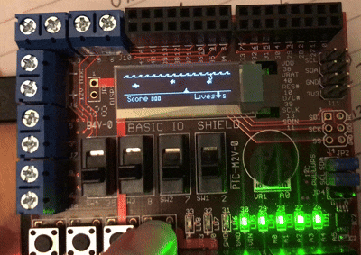

This is a project created by Alicia van Zijl.

# A Platform Game for ChipKit uC32 and Basic I/O Shield: Swimmy Shark.

_March 2021_

  

It is based on a project template provided by IS1200 teachers.

Some functions were copied from lab files and documentation, these have been marked as such in the comments.

The template provided by IS1200 contained the following:
+ Makefile provided by IS1200.
+ main.c: Contains the entry point main()
+ vectors.S:  Contains the interrupt handler and the exception handler
+ stubs.c:  Contains stubs for functions run during micro controller initialization
